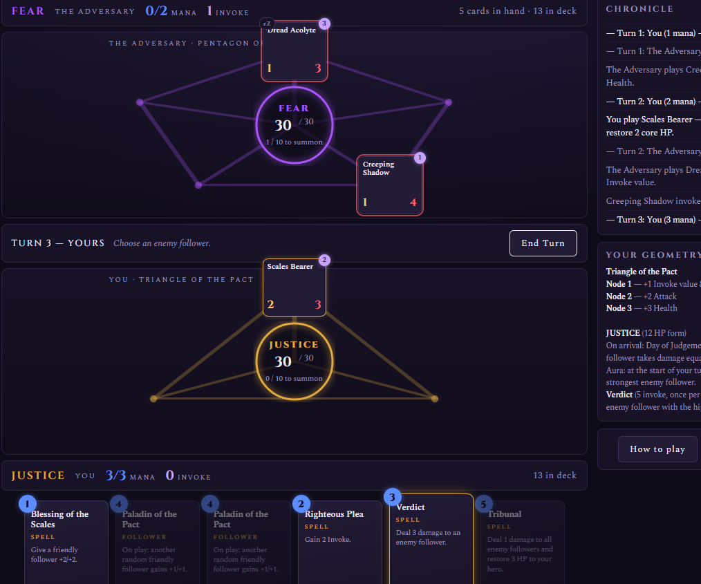

# ABSTRACTS

*A summoning card game where concepts take form.*

**[▶ Play it now](https://alex-caian.github.io/abstracts/)** — single-player vs. the Adversary, in your browser. Nothing to install.



---

## The concept

Abstracts is a Hearthstone-style duelling card game built around anthropomorphised concepts — **Fear**, **Justice**, and **Knowledge**. You do not play a hero who summons creatures; you *are* the concept, and the game is the struggle to give yourself form.

Each Abstract fights on its own **geometry**: Fear commands a pentagon, Justice a triangle, Knowledge a hexagon. Followers are played onto the nodes of your geometry, and every node grants a different bonus — the same card becomes a different threat depending on where you place it.

## How to play

### The goal

Your **core** — 30 HP of latent essence — rests at the centre of your geometry. Reduce the enemy core to 0 and their concept dissolves. Protect your own at all costs.

### Turns

Each turn you gain a mana crystal (up to 10), refill your mana, and draw a card. Then:

- **Drag followers** from your hand onto the empty nodes (dots) of your geometry. Hover a dot to see the bonus it grants.
- **Click spells** to cast them — they resolve immediately; some ask for a target.
- **Click a glowing follower** to act with it. Followers act once per turn, but never on the turn they are played (they rest, marked **zZ**).

A follower can do one of two things with its action:

- **Attack** — strike an enemy follower, or the enemy face at the centre of their geometry.
- **Invoke** — channel its invoke value (the violet badge) into your essence instead of fighting.

Every turn poses the same dilemma: press the attack, hold the line, or hasten the summoning.

### Invoke is a currency

Invoke accrues without limit and is never wasted. You spend it on two things:

| Purchase | Cost |
|---|---|
| Summon your form | 10 invoke, then 15, 20, 25… each time it is unmade |
| Your form's active ability | varies by Abstract, once per turn |

### The manifested form

When you summon, your Abstract takes physical form at the centre. While it stands, it **shields your core completely** — all face damage strikes the form, and nothing spills through. The form cannot attack or invoke; its power is presence:

| | **FEAR** | **JUSTICE** | **KNOWLEDGE** |
|---|---|---|---|
| Geometry | Pentagon (5 nodes) | Triangle (3 nodes) | Hexagon (6 nodes) |
| Form HP | 9 | 12 | 10 |
| On arrival | Every empty node fills with a 1/1 Terror Spider | Day of Judgement: each enemy follower takes damage equal to its own Attack | Awakening: your followers gain +1 invoke value; draw a card |
| Aura (each turn) | 2 damage to the enemy | 3 damage to the strongest enemy follower | 2 damage to the enemy and draw a card |
| Ability (invoke cost) | Creeping Terror (4): all enemy followers −1 Attack | Verdict (5): destroy the strongest enemy follower | Insight (3): draw 2 cards |

Break the enemy's form and their core lies exposed — but watch the invoke meter: a slain Abstract can always return, at a price.

### Controls

| Input | Action |
|---|---|
| Drag a card to a node | Play a follower |
| Click a card | Cast a spell |
| Click a glowing follower | Choose its action (attack targets light up) |
| **Esc** / Cancel / click empty ground | Deselect |
| **Enter** | End turn |

## Running locally

No build step, no dependencies, no server. The game is plain HTML, CSS, and JavaScript:

```bash
git clone https://github.com/Alex-Caian/abstracts.git
cd abstracts
# open index.html in any modern browser — that's it
```

## Project structure

```
abstracts/
├── index.html          # markup shell; loads styles and scripts in order
├── css/
│   └── style.css       # all styling, theming via CSS custom properties
└── js/
    ├── config.js       # game constants and node-effect definitions
    ├── cards.js        # the card database (followers and spells)
    ├── archetypes.js   # the three Abstracts: geometry, decks, powers
    ├── state.js        # game state container and accessors
    ├── engine.js       # core rules: turns, combat, invoke, summoning
    ├── ai.js           # the Adversary's decision-making
    ├── render.js       # all DOM rendering (no game rules here)
    ├── input.js        # click, drag-and-drop, and keyboard handling
    └── main.js         # bootstrap and deck-select screen
```

### Architecture notes

- **Zero dependencies.** Vanilla JavaScript with plain `<script>` tags sharing global scope — load order in `index.html` matters and is documented there.
- **Data-driven design.** Cards, archetypes, and node effects are declarative objects in `cards.js`, `archetypes.js`, and `config.js`. Adding a card is one line; adding an Abstract is one object (geometry, deck, and powers included).
- **Strict layering.** `engine.js` contains rules and never touches the DOM beyond delegated helpers; `render.js` draws state and contains no rules; `input.js` translates user intent into engine calls.
- **One quirk worth knowing:** the hand is never re-rendered during a drag — destroying the dragged element mid-drag silently kills the browser's drag operation. Node highlights during drag are applied directly rather than through the normal render pass (see `input.js`).

## Releases

The project follows a staging → release flow: changes are developed and playtested in a local staging copy, then copied here, committed, and tagged (`v0.x.y`, loosely semantic — middle number for mechanics and features, last for fixes). Each push to `main` deploys automatically to GitHub Pages.

| Version | Highlights |
|---|---|
| v0.2.0 | Invoke economy rework: the Abstract *is* the player — 30 HP core, pure-HP shield forms, resummoning at escalating cost, arrival powers, once-per-turn abilities, hover tooltips |
| v0.1.x | Initial release: three decks, node geometries, drag-and-drop, click-to-attack, NPC opponent |

## Roadmap

- Balance instrumentation: automated AI-vs-AI batches to measure win rates and summon-race advantage
- More followers and spells per archetype, then a deck-building screen
- Unlockable cards
- New Abstracts beyond the founding three
- Commit the headless test harness (jsdom-based) used during development

## Credits

Designed by Alex, built with Claude Fable 5.
