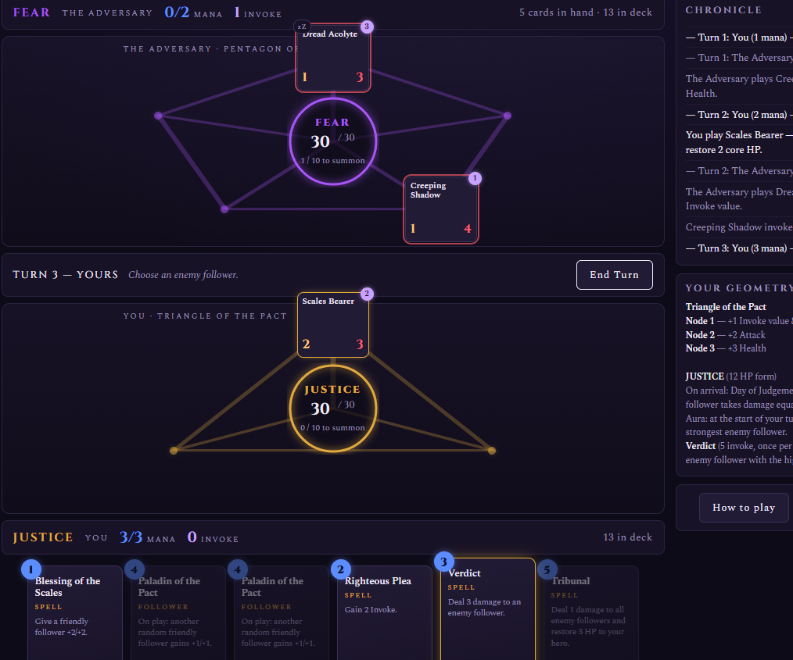

# ABSTRACTS

*A summoning card game where concepts take form.*

**[▶ Play it now](https://alex-caian.github.io/abstracts/)** — single-player vs. the Adversary, in your browser. Nothing to install.



---

## The concept

Abstracts is a duelling card game built around anthropomorphised concepts — **Fear**, **Justice**, and **Knowledge**. You do not play a hero who summons creatures; you *are* the concept, and the game is the struggle to give yourself form.

Each Abstract fights on its own **geometry**: Fear commands a pentagon, Justice a triangle, Knowledge a sprawling octagon it can refine. Followers are played onto the nodes of your geometry, and every node grants a different bonus — the same card becomes a different threat depending on where you place it. But position matters far beyond bonuses: the ritual itself flows through the diagram's edges.

## How to play

### The goal

Your **core** — 30 HP of latent essence — rests at the centre of your geometry. Reduce the enemy core to 0 and their concept dissolves. Protect your own at all costs.

### Turns

Each turn you gain a mana crystal (up to 10), refill your mana, and draw a card. Then:

- **Drag followers** from your hand onto the empty nodes (dots) of your geometry. Hover a dot to see the bonus it grants.
- **Click spells** to cast them — they resolve immediately; some ask for a target.
- **Click a glowing follower** to act with it. Followers act once per turn, but never on the turn they are played (they rest, marked **zZ**).

A follower can do one of two things with its action:

- **Attack** — strike an enemy follower, or the enemy face at the centre of their geometry.
- **Invoke** — channel its invoke value (the violet badge) into your essence instead of fighting.

Every turn poses the same dilemma: press the attack, hold the line, or feed the circle.

### The ritual: links and communion

Followers on **adjacent** nodes form a **link** — the edge between them ignites. Links are the conduit of the ritual:

- A follower can only **invoke while linked**. An isolated follower cannot channel (its badge dims), and not every follower can invoke at all.
- Start your turn with **every node filled** and the completed circle enters **communion**, channelling **+1 essence per follower** passively — the bigger your geometry, the louder it sings. Your opponent will be looking to break the circle before your turn comes around.

### Essence is a currency

Essence accrues without limit and is never wasted. You spend it on two things:

| Purchase | Cost |
|---|---|
| Summon your form | **Fear 9 · Knowledge 13 · Justice 15**, +5 each time it is unmade |
| Your form's active ability | varies by Abstract, once per turn |

### The manifested form

When you summon, your Abstract takes physical form at the centre. While it stands, it **shields your core completely** — all face damage strikes the form, and nothing spills through. The form cannot attack or invoke; its power is presence. All auras trigger at the start of your turn.

| | **FEAR** | **JUSTICE** | **KNOWLEDGE** |
|---|---|---|---|
| Geometry | Pentagon (5 nodes) | Triangle (3 nodes) | Octagon (8 nodes, distillable to 4) |
| Form HP / summon cost | 6 HP · 9 essence | 10 HP · 15 essence | 10 HP · 13 essence |
| On arrival | Every empty node fills with a 1/1 Terror Spider | Day of Judgement: each enemy follower takes damage equal to its own Attack | Awakening: your followers gain +1 invoke value; draw a card |
| Aura | 2 damage, and a random enemy follower is Terrified (cannot act next turn) | If outnumbered, 2 damage to a random enemy follower; if ahead, restore 2 HP; at even numbers, both | Draw a card and gain 1 mana |
| Ability (essence) | Brood (3): summon a 2/2 Giant Spider that deals 1 damage on death | Verdict (6): destroy the strongest enemy follower | Insight (4): draw 2 cards; in communion, also +1 essence and 1 damage |

Three relationships with the god: Fear is cheap to conjure, quick to fall, and always returning — an aggro deck whose summon is a weapon. Justice is the expensive fortress, arriving late and judging hard. Knowledge sits between, and it alone can **distil** its diagram: spells dissolve empty nodes forever, neighbours join (sometimes forging new links), the polygon redraws itself, and communion comes within reach.

### Statuses

A few effects hold a follower in check. **Terrified** means simply *cannot act* — used everywhere a follower is frozen for a turn (Fear's aura, Paralysing Fright). Some sources stack extra harm on top: Paralysing Fright, for instance, Terrifies a follower for two turns *and* bleeds it 1 each turn. Hover any follower to read its current statuses in full.

### The litany

Your deck never runs dry: when it empties, your spent cards shuffle back in — *the litany begins anew*. But a card drawn to a full hand is **forgotten**, gone from the cycle for good. A rare few cards are **Apparitions** — capped at one per deck and forgotten the moment they are played. And no duel lasts forever: from turn 25, both cores decay at the start of each turn — 1, then 2, then 3… Reality reasserts itself.

### Controls

| Input | Action |
|---|---|
| Drag a card to a node | Play a follower |
| Click a card | Cast a spell |
| Click a glowing follower | Choose its action (attack targets light up) |
| **Esc** / Cancel / click empty ground | Deselect |
| **Enter** | End turn |

## Accounts, decks & campaign

Free play needs no account — pick an Abstract and duel the Adversary. Sign in with Google to unlock the rest:

- **Decks.** Each Abstract has a read-only default deck plus up to three of your own: 20 cards, at most 3 copies of any card (1 for Apparitions). Build and rename them in the deck editor.
- **Collection.** Browse every card by Abstract. Locked cards stay visible and show how they are earned.
- **Campaign.** *Welcome to Abstracts* is a sequence of designed duels, each with a short tutorial, a tailored opponent, and a card reward granted on your first victory. Three spells are earned only this way: **Mind Surge**, **Chess Move**, and **Paralysing Fright**. Completing it opens the story campaigns — *The Weaving Dark* (Fear) and *The Ancient Discovery* (Knowledge) — eight stages each, with four unlockable cards apiece.

Every game opens with a **coin flip** for turn order; whoever goes second draws an extra opening card to compensate.

Your account stores only a small profile — username, chosen emblem, decks, unlocked cards, and campaign progress. Card and rule definitions live in the game code, never on the server, and security is enforced by Google sign-in plus per-user database rules.

## Running locally

The game is a [Vite](https://vitejs.dev/) project. With [Node.js](https://nodejs.org/) installed:

```bash
git clone https://github.com/Alex-Caian/abstracts.git
cd abstracts
npm install
npm run dev      # local dev server with hot reload
npm run build    # production build into dist/
```

The game logic is plain classic scripts served as-is; only the accounts layer (Firebase) is bundled. The core game runs without an account — sign-in and saved progress require the Firebase project to be configured.

## Project structure

```
abstracts/
├── index.html              # markup shell; loads the game scripts in order + the accounts module
├── package.json            # Vite (dev) and Firebase
├── vite.config.js          # base:'./' for the /abstracts/ GitHub Pages sub-path
├── public/                 # served verbatim by Vite (not bundled)
│   ├── css/style.css       # all styling, theming via CSS custom properties
│   ├── playmats/           # per-Abstract board backdrops
│   └── js/                 # classic global scripts (shared scope, load order matters)
│       ├── config.js       # game constants and node-effect definitions
│       ├── cards.js        # the card database (followers and spells)
│       ├── archetypes.js   # the three Abstracts: geometry, decks, powers
│       ├── state.js        # game state container and accessors
│       ├── engine.js       # core rules: turns, combat, essence, summoning
│       ├── ai.js           # the Adversary: plays either seat, links-aware
│       ├── render.js       # all DOM rendering (no game rules here)
│       ├── input.js        # click, drag-and-drop, and keyboard handling
│       ├── campaign.js     # campaign definitions and progression
│       ├── main.js         # bootstrap, menus, and tutorials
│       ├── collection.js   # the card collection gallery
│       └── decks.js        # the deck manager and editor
└── src/
    └── account.js          # the only bundled module: Firebase auth + per-user profile
```

### Architecture notes

- **Deliberately hybrid.** The game itself is dependency-free vanilla JavaScript — plain `<script>` tags sharing global scope, load order documented in `index.html`. Only the accounts layer (`src/account.js`) is an ES module that Vite bundles, pulling in Firebase. The two halves bridge through `window.Abstracts` and `window.Account`.
- **Data-driven design.** Cards, archetypes, node effects, and campaigns are declarative objects in `cards.js`, `archetypes.js`, `config.js`, and `campaign.js`. Adding a card is one line; adding an Abstract is one object. Geometry is per-player and mutable at runtime — Knowledge's Distillation reshapes the board mid-game.
- **Strict layering.** `engine.js` contains rules and never touches the DOM beyond delegated helpers; `render.js` draws state and contains no rules; `input.js` translates user intent into engine calls. This separation is what keeps eventual host-authoritative multiplayer feasible.
- **Touch-first dragging.** Drag-and-drop is built on Pointer Events rather than the HTML5 drag API, so the same code path serves mouse and touch — the game is playable on mobile. A ghost card follows the pointer and the drop target is resolved with `elementFromPoint`.
- **Public by design.** The Firebase web config is shipped in the client (it is an identifier, not a secret); all real protection lives in Firebase Auth and Firestore security rules.

## Releases

The project follows a staging → release flow: changes are developed and playtested in a local staging copy, then copied here, committed, and tagged (`v0.x.y`, loosely semantic — middle number for mechanics and features, last for fixes). A GitHub Actions workflow builds the site with Vite and deploys it to GitHub Pages on every push to `main`.

| Version | Highlights |
|---|---|
| v0.3.2 | The second campaign — **The Ancient Discovery**, an eight-stage Knowledge story about outlasting and big moments, ending with Fear and Justice united against you. It brings four unlockable Knowledge cards: **Time Borrower** (a follower cast on top of one of your own to hide it, returning it stronger when the Borrower dies), **Mirror Display** (enemy followers that attack take damage equal to their own Attack), **Dimensional Illusion** (a late-game X/2X body sized by the distinct spells you have cast, lasting as many turns as nodes you have distilled), and the apparition **Ancient Arcana** (a spell whose gift changes with how many times you have summoned your form). New foe tricks throughout: Boons that spawn followers every turn, Boons whose price escalates, **Execution** (a sentenced follower dies a turn later), forms that arrive on a countdown, forms guarded by their followers, and a brittle core behind a one-essence shell. Changes to live content: **Senths, the Mother** is now **Warded** (the first enemy spell that targets her is undone) and her Hellspawn appears whenever she leaves the board, not only on death; campaign stages now open with a single line naming your opponent in place of the longer dialogue; a manifested form now shakes only when the core itself is struck |
| v0.3.1 | The first full campaign — **The Weaving Dark**, an eight-stage Fear story where Justice and Knowledge close ranks against you, ending in a two-on-one finale. It brings four spider-themed unlockable cards: **Growth Spider** (a self-growing draw engine), **Tainted Dreams** (a stacking curse that bleeds a follower or abstract), **Web-spinning** (bond two of your nodes so each echoes the other's invoke and attack), and the apparition **Senths, the Mother** (whose death births a cascade of horrors). New foe systems on show throughout — **Boons** (passive, paid, and static modifiers shown beside the enemy's board), pre-match **dialogue**, reviving "final stand" bosses, pre-summoned and pre-distilled opponents, and illusion/mirror matches. Plus a menu cover backdrop, a Collection mana filter, and assorted polish |
| v0.3.0 | The progression update. **Accounts** (Google sign-in, editable username, profile emblems) unlock **deck-building** (custom 20-card decks with per-card copy caps and an Apparition class), a **Collection** gallery that shows how locked cards are earned, and a multi-stage **Campaign** — *Welcome to Abstracts* — with tutorials, tailored opponents, and cards won by playing, including three new unlockable spells: Mind Surge, Chess Move, and Paralysing Fright. Every duel now opens with a **coin-flip** turn order (the second player draws an extra card). Full **balance + lore pass** across all three Abstracts, with new Justice cards (Oathkeeper, Magistrate, Punishing Brute) and per-Abstract playmats. **Terrified** is now the single "cannot act" status. Fear toned down: summon 8→9, Terror Spiders lose invoke, aura 3→2 (Knowledge summon 12→13). Under the hood, the static site becomes a Vite build with a Firebase backend, deployed via GitHub Actions |
| v0.2.4 | The centre becomes the concept: the HP ring gives way to each Abstract's emblem — sword→scales, egg-sac→spider, closed→open book — which awakens on summon (larger, glowing, gently breathing while manifested, and fading to black as the core bleeds). Spell casts crumble to dust as a "spent" cue; triumph now takes your own deck's colour; the opponent's hand is shown face-down. Balance: Twin Prophets only doubles on adjacent nodes (else one), Justice's aura reworked — strike when outnumbered, mend 2 when ahead, both when even — and Tribunal dropped to 4 mana. Trimmed UI text: board labels and the misleading "cannot invoke" note removed |
| v0.2.3 | Polish pass: spokes now light from each occupied node to the core (quieter than links), the core luminates when a summon is affordable and arrives with an ignite-and-shockwave flourish, Tribunal heals the manifested form, lore wording tightened (core, never "hero"), unused cards retired ahead of deck-building, and dead CSS/tooltip duplication cleaned up |
| v0.2.2 | The ritual update: link-gated invoking, communion, per-Abstract summon costs, Knowledge's distillable octagon (Twin Prophets, Veil of Theory, Distillation, Refutation), aggro Fear (cheap recurring form, Mass Hysteria, Giant Spiders), the litany (decks recycle, overdraw forgets), turn-25 decay clock, Terrified status, AI-vs-AI balance simulator |
| v0.2.1 | Mobile support: drag-and-drop rebuilt on Pointer Events (touch and mouse), ghost-card drag preview, ghost-click suppression |
| v0.2.0 | Invoke economy rework: the Abstract *is* the player — 30 HP core, pure-HP shield forms, resummoning at escalating cost, arrival powers, once-per-turn abilities, hover tooltips |
| v0.1.x | Initial release: three decks, node geometries, drag-and-drop, click-to-attack, NPC opponent |

## Roadmap

- **Progression (v0.3.x)** — *shipped.* Accounts, card collections, deck-building, and a campaign that unlocks cards through play. No pack openings, ever: rewards come from winning.
- **More content (v0.3.x)** — further campaigns and stages, the first true Apparition cards, and deeper card pools so decks can tighten toward max-two copies.
- **Multiplayer (v0.4.x)** — private 1v1 rooms via shareable code, turn-based and host-authoritative (no matchmaking, no game server).
- **Visual overhaul (v0.5.x)** — effects, card art, and flavour treatment for the Abstracts.
- **The balance break** — deck-aware AI opponents and serious meta tuning, building on the simulator.
- **New Abstracts (v0.6.x)** — one or two new concepts, each bending a different rule, introduced through the campaign.
- Commit the headless test harness and simulator used during development.

## Credits

Designed by Alex, built with Claude Fable 5.
